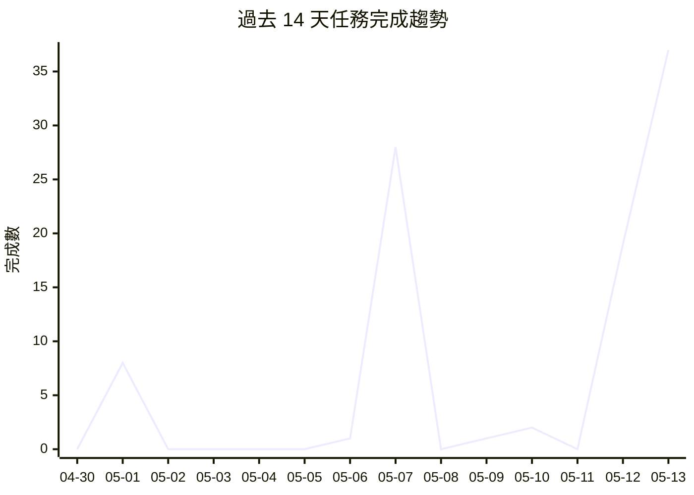

# 📁 Projects Dashboard

> 最後更新: 2026-05-13 22:59 · 自動生成

---

## 📊 總覽

| 指標 | 數量 |
|------|------|
| 專案數 | 49 |
| 任務總數 | 352 |
| ✅ 已完成 | 332 |
| ⬜ 待處理 | 11 |
| 🔄 進行中 | 2 |
| ⏭️ 跳過 | 7 |
| 總完成率 | 96% |

## 🔥 待處理高優先級任務

| 專案 | 任務 | 標題 |
|------|------|------|
| Javis | [T002-install-mnn-llm-qwen](https://github.com/openclawchen8-lgtm/openclaw-tasks/blob/main/Javis/tasks/T002-install-mnn-llm-qwen.md) | T002-安裝MNN-LLM與下載Qwen模型 |
| Javis | [T040-hf-image-generation](https://github.com/openclawchen8-lgtm/openclaw-tasks/blob/main/Javis/tasks/T040-hf-image-generation.md) | Hugging Face 圖像生成技能 |
| Javis | [T042-uniTalker-MNN](https://github.com/openclawchen8-lgtm/openclaw-tasks/blob/main/Javis/tasks/T042-uniTalker-MNN.md) | UniTalker-MNN 數位人整合 |
| Javis | [T043-KlingAI-LivePortrait](https://github.com/openclawchen8-lgtm/openclaw-tasks/blob/main/Javis/tasks/T043-KlingAI-LivePortrait.md) | KlingAI LivePortrait 數位人整合 |
| md-viewer-app | [T023-滾動位置保持](https://github.com/openclawchen8-lgtm/openclaw-tasks/blob/main/md-viewer-app/tasks/T023-滾動位置保持.md) | [T023] 滾動位置保持 |

---

## ⬜ 待處理

| 專案 | 任務 | 標題 | 狀態 |
|------|------|------|------|
| Javis | [T002-install-mnn-llm-qwen](https://github.com/openclawchen8-lgtm/openclaw-tasks/blob/main/Javis/tasks/T002-install-mnn-llm-qwen.md) | T002-安裝MNN-LLM與下載Qwen模型 | ⬜ |
| Javis | [T021-jitsi-audio-capture](https://github.com/openclawchen8-lgtm/openclaw-tasks/blob/main/Javis/tasks/T021-jitsi-audio-capture.md) | Jitsi 語音串接 — 音訊捕獲 | ⬜ |
| Javis | [T022-jitsi-audio-playback](https://github.com/openclawchen8-lgtm/openclaw-tasks/blob/main/Javis/tasks/T022-jitsi-audio-playback.md) | Jitsi 語音串接 — 音訊播放回會議室 | ⬜ |
| Javis | [T040-hf-image-generation](https://github.com/openclawchen8-lgtm/openclaw-tasks/blob/main/Javis/tasks/T040-hf-image-generation.md) | Hugging Face 圖像生成技能 | ⬜ |
| Javis | [T042-uniTalker-MNN](https://github.com/openclawchen8-lgtm/openclaw-tasks/blob/main/Javis/tasks/T042-uniTalker-MNN.md) | UniTalker-MNN 數位人整合 | ⬜ |
| Javis | [T043-KlingAI-LivePortrait](https://github.com/openclawchen8-lgtm/openclaw-tasks/blob/main/Javis/tasks/T043-KlingAI-LivePortrait.md) | KlingAI LivePortrait 數位人整合 | ⬜ |
| gold-analysis-advanced | [T002](https://github.com/openclawchen8-lgtm/openclaw-tasks/blob/main/gold-analysis-advanced/tasks/T002.md) | ML 模型整合與優化 | ⬜ |
| gold-analysis-advanced | [T004](https://github.com/openclawchen8-lgtm/openclaw-tasks/blob/main/gold-analysis-advanced/tasks/T004.md) | 實盤交易對接 | ⬜ |
| md-viewer-app | [T023-滾動位置保持](https://github.com/openclawchen8-lgtm/openclaw-tasks/blob/main/md-viewer-app/tasks/T023-滾動位置保持.md) | [T023] 滾動位置保持 | ⬜ |
| md-viewer-app | [T027-預覽連結懸停](https://github.com/openclawchen8-lgtm/openclaw-tasks/blob/main/md-viewer-app/tasks/T027-預覽連結懸停.md) | [T027] 連結懸停預覽 | ⬜ |
| revenue-zero-cost | [T008](https://github.com/openclawchen8-lgtm/openclaw-tasks/blob/main/revenue-zero-cost/tasks/T008.md) | 技術社群曝光 | ⬜ |

## 🔄 進行中

| 專案 | 任務 | 標題 | 狀態 |
|------|------|------|------|
| gold-analysis-advanced | [T001](https://github.com/openclawchen8-lgtm/openclaw-tasks/blob/main/gold-analysis-advanced/tasks/T001.md) | 機器學習模型開發 | 🔄 |
| md-viewer-app | [T026-專注模式](https://github.com/openclawchen8-lgtm/openclaw-tasks/blob/main/md-viewer-app/tasks/T026-專注模式.md) | [T026] 專注模式（Focus Mode） | 🔄 |

## ⏭️ 跳過

| 專案 | 任務 | 標題 | 狀態 |
|------|------|------|------|
| gold-analysis-core | [T003-C](https://github.com/openclawchen8-lgtm/openclaw-tasks/blob/main/gold-analysis-core/tasks/T003-C.md) | 數據庫模組測試 | ⏭️ |
| gold-monitor-issue | [T005](https://github.com/openclawchen8-lgtm/openclaw-tasks/blob/main/gold-monitor-issue/tasks/T005.md) | 請檢查及修正 黃金存摺價格監控 的問題（見 T001） | ⏭️ |
| gold-monitor-issue | [T006](https://github.com/openclawchen8-lgtm/openclaw-tasks/blob/main/gold-monitor-issue/tasks/T006.md) | 更新為同時抓取及顯示 黃金存摺 賣出 買入 價格（見 T004） | ⏭️ |
| md-viewer-app | [T004-實作-側邊欄-檔案列表](https://github.com/openclawchen8-lgtm/openclaw-tasks/blob/main/md-viewer-app/tasks/T004-實作-側邊欄-檔案列表.md) | 實作側邊欄檔案列表 | ⏭️ |
| md-viewer-app | [T015-Quick-Look-插件](https://github.com/openclawchen8-lgtm/openclaw-tasks/blob/main/md-viewer-app/tasks/T015-Quick-Look-插件.md) | [T015] Quick Look 插件 | ⏭️ |
| md-viewer-app | [T018-置頂小窗模式](https://github.com/openclawchen8-lgtm/openclaw-tasks/blob/main/md-viewer-app/tasks/T018-置頂小窗模式.md) | [T018] 置頂小窗模式 | ⏭️ |
| sinotrade-scraper | [T008](https://github.com/openclawchen8-lgtm/openclaw-tasks/blob/main/sinotrade-scraper/tasks/T008.md) | 完整報告內容讀取（需登入，暫緩） | ⏭️ |

---

## 📈 效能分析

| 指標 | 數值 |
|------|------|
| 過去 7 天完成 | 88 |
| 過去 30 天完成 | 233 |
| 平均週期時間 | 0.9 天 |
| 週期時間中位數 | 0.0 天 |

📊 總計: 96 | 日均: 6.9 | 本週: 87 | 📈 成長中

## 📋 專案列表

| 狀態 | 專案 | 總數 | ✅ | ⬜ | 🔄 | ⏭️ | 進度 | 更新 |
|------|------|------|----|----|----|----|------|------|
| ⬜ | [Javis](https://github.com/openclawchen8-lgtm/openclaw-tasks/tree/main/Javis) | 43 | 37 | 6 | 0 | 0 | █████████████████░░░ 86% | 2026-05-13 |
  **[T002-install-mnn-llm-qwen](https://github.com/openclawchen8-lgtm/openclaw-tasks/blob/main/Javis/tasks/T002-install-mnn-llm-qwen.md)**: T002-安裝MNN-LLM與下載Qwen模型
  **[T040-hf-image-generation](https://github.com/openclawchen8-lgtm/openclaw-tasks/blob/main/Javis/tasks/T040-hf-image-generation.md)**: Hugging Face 圖像生成技能
  **[T042-uniTalker-MNN](https://github.com/openclawchen8-lgtm/openclaw-tasks/blob/main/Javis/tasks/T042-uniTalker-MNN.md)**: UniTalker-MNN 數位人整合
  **[T043-KlingAI-LivePortrait](https://github.com/openclawchen8-lgtm/openclaw-tasks/blob/main/Javis/tasks/T043-KlingAI-LivePortrait.md)**: KlingAI LivePortrait 數位人整合
| ✅ | [agent-config](https://github.com/openclawchen8-lgtm/openclaw-tasks/tree/main/agent-config) | 9 | 9 | 0 | 0 | 0 | ████████████████████ 100% | 2026-04-09 |
| ✅ | [backup-system](https://github.com/openclawchen8-lgtm/openclaw-tasks/tree/main/backup-system) | 5 | 5 | 0 | 0 | 0 | ████████████████████ 100% | 2026-04-15 |
| ✅ | [claw-sessions-issue](https://github.com/openclawchen8-lgtm/openclaw-tasks/tree/main/claw-sessions-issue) | 1 | 1 | 0 | 0 | 0 | ████████████████████ 100% | 2026-04-16 |
| ✅ | [clawhub-oauth-investigation](https://github.com/openclawchen8-lgtm/openclaw-tasks/tree/main/clawhub-oauth-investigation) | 2 | 2 | 0 | 0 | 0 | ████████████████████ 100% | 2026-04-22 |
| ✅ | [cmd-log-parser](https://github.com/openclawchen8-lgtm/openclaw-tasks/tree/main/cmd-log-parser) | 3 | 3 | 0 | 0 | 0 | ████████████████████ 100% | 2026-04-16 |
| ✅ | [cnyes-stock](https://github.com/openclawchen8-lgtm/openclaw-tasks/tree/main/cnyes-stock) | 16 | 16 | 0 | 0 | 0 | ████████████████████ 100% | 2026-05-12 |
| ✅ | [dashboard-tool](https://github.com/openclawchen8-lgtm/openclaw-tasks/tree/main/dashboard-tool) | 5 | 5 | 0 | 0 | 0 | ████████████████████ 100% | 2026-04-09 |
| ✅ | [elevenlabs-research](https://github.com/openclawchen8-lgtm/openclaw-tasks/tree/main/elevenlabs-research) | 1 | 1 | 0 | 0 | 0 | ████████████████████ 100% | 2026-04-21 |
| ✅ | [github-data-review](https://github.com/openclawchen8-lgtm/openclaw-tasks/tree/main/github-data-review) | 8 | 8 | 0 | 0 | 0 | ████████████████████ 100% | 2026-04-28 |
| ✅ | [global-policy-refactor](https://github.com/openclawchen8-lgtm/openclaw-tasks/tree/main/global-policy-refactor) | 3 | 3 | 0 | 0 | 0 | ████████████████████ 100% | 2026-05-07 |
| 🔄 | [gold-analysis-advanced](https://github.com/openclawchen8-lgtm/openclaw-tasks/tree/main/gold-analysis-advanced) | 4 | 1 | 2 | 1 | 0 | █████░░░░░░░░░░░░░░░ 25% | 2026-04-22 |
| ✅ | [gold-analysis-core](https://github.com/openclawchen8-lgtm/openclaw-tasks/tree/main/gold-analysis-core) | 29 | 28 | 0 | 0 | 1 | ████████████████████ 100% | 2026-04-16 |
| ✅ | [gold-analysis-extend](https://github.com/openclawchen8-lgtm/openclaw-tasks/tree/main/gold-analysis-extend) | 6 | 6 | 0 | 0 | 0 | ████████████████████ 100% | 2026-04-07 |
| ✅ | [gold-analysis-improve](https://github.com/openclawchen8-lgtm/openclaw-tasks/tree/main/gold-analysis-improve) | 12 | 12 | 0 | 0 | 0 | ████████████████████ 100% | 2026-05-07 |
| ✅ | [gold-analysis-merge](https://github.com/openclawchen8-lgtm/openclaw-tasks/tree/main/gold-analysis-merge) | 1 | 1 | 0 | 0 | 0 | ████████████████████ 100% | 2026-04-18 |
| ✅ | [gold-analysis-platform](https://github.com/openclawchen8-lgtm/openclaw-tasks/tree/main/gold-analysis-platform) | 3 | 3 | 0 | 0 | 0 | ████████████████████ 100% | 2026-04-07 |
| ✅ | [gold-monitor-issue](https://github.com/openclawchen8-lgtm/openclaw-tasks/tree/main/gold-monitor-issue) | 8 | 6 | 0 | 0 | 2 | ████████████████████ 100% | 2026-05-07 |
| ✅ | [gold-monitor-pro-v4](https://github.com/openclawchen8-lgtm/openclaw-tasks/tree/main/gold-monitor-pro-v4) | 8 | 8 | 0 | 0 | 0 | ████████████████████ 100% | 2026-05-01 |
| ✅ | [gpt-sovits-research](https://github.com/openclawchen8-lgtm/openclaw-tasks/tree/main/gpt-sovits-research) | 1 | 1 | 0 | 0 | 0 | ████████████████████ 100% | 2026-04-21 |
| ✅ | [gpt-sovits-voice-presets-research](https://github.com/openclawchen8-lgtm/openclaw-tasks/tree/main/gpt-sovits-voice-presets-research) | 1 | 1 | 0 | 0 | 0 | ████████████████████ 100% | 2026-04-21 |
| ✅ | [gpt-sovits-voices-research](https://github.com/openclawchen8-lgtm/openclaw-tasks/tree/main/gpt-sovits-voices-research) | 1 | 1 | 0 | 0 | 0 | ████████████████████ 100% | 2026-04-21 |
| ✅ | [ideas2tasks](https://github.com/openclawchen8-lgtm/openclaw-tasks/tree/main/ideas2tasks) | 11 | 11 | 0 | 0 | 0 | ████████████████████ 100% | 2026-04-23 |
| ✅ | [ideas2tasks-fix](https://github.com/openclawchen8-lgtm/openclaw-tasks/tree/main/ideas2tasks-fix) | 5 | 5 | 0 | 0 | 0 | ████████████████████ 100% | 2026-04-16 |
| ✅ | [ideas2tasks-improvements](https://github.com/openclawchen8-lgtm/openclaw-tasks/tree/main/ideas2tasks-improvements) | 7 | 7 | 0 | 0 | 0 | ████████████████████ 100% | 2026-05-12 |
| ✅ | [kgi-monitor](https://github.com/openclawchen8-lgtm/openclaw-tasks/tree/main/kgi-monitor) | 6 | 6 | 0 | 0 | 0 | ████████████████████ 100% | 2026-04-22 |
| ✅ | [lifecycle-sync-fix](https://github.com/openclawchen8-lgtm/openclaw-tasks/tree/main/lifecycle-sync-fix) | 2 | 2 | 0 | 0 | 0 | ████████████████████ 100% | 2026-04-21 |
| ✅ | [llm-router](https://github.com/openclawchen8-lgtm/openclaw-tasks/tree/main/llm-router) | 1 | 1 | 0 | 0 | 0 | ████████████████████ 100% | 2026-04-16 |
| 🔄 | [md-viewer-app](https://github.com/openclawchen8-lgtm/openclaw-tasks/tree/main/md-viewer-app) | 44 | 38 | 2 | 1 | 3 | ██████████████████░░ 92% | 2026-05-12 |
  **[T023-滾動位置保持](https://github.com/openclawchen8-lgtm/openclaw-tasks/blob/main/md-viewer-app/tasks/T023-滾動位置保持.md)**: [T023] 滾動位置保持
| ✅ | [member-backup](https://github.com/openclawchen8-lgtm/openclaw-tasks/tree/main/member-backup) | 1 | 1 | 0 | 0 | 0 | ████████████████████ 100% | 2026-04-16 |
| ✅ | [member-config-review](https://github.com/openclawchen8-lgtm/openclaw-tasks/tree/main/member-config-review) | 7 | 7 | 0 | 0 | 0 | ████████████████████ 100% | 2026-04-19 |
| ✅ | [member-tasks](https://github.com/openclawchen8-lgtm/openclaw-tasks/tree/main/member-tasks) | 5 | 5 | 0 | 0 | 0 | ████████████████████ 100% | 2026-04-04 |
| ✅ | [openclaw](https://github.com/openclawchen8-lgtm/openclaw-tasks/tree/main/openclaw) | 6 | 6 | 0 | 0 | 0 | ████████████████████ 100% | 2026-05-07 |
| ✅ | [openclaw-scrum](https://github.com/openclawchen8-lgtm/openclaw-tasks/tree/main/openclaw-scrum) | 7 | 7 | 0 | 0 | 0 | ████████████████████ 100% | 2026-04-16 |
| ✅ | [read](https://github.com/openclawchen8-lgtm/openclaw-tasks/tree/main/read) | 2 | 2 | 0 | 0 | 0 | ████████████████████ 100% | 2026-05-07 |
| ✅ | [research](https://github.com/openclawchen8-lgtm/openclaw-tasks/tree/main/research) | 1 | 1 | 0 | 0 | 0 | ████████████████████ 100% | 2026-04-28 |
| ⬜ | [revenue-zero-cost](https://github.com/openclawchen8-lgtm/openclaw-tasks/tree/main/revenue-zero-cost) | 15 | 14 | 1 | 0 | 0 | ██████████████████░░ 93% | 2026-04-20 |
| ✅ | [security-improvements](https://github.com/openclawchen8-lgtm/openclaw-tasks/tree/main/security-improvements) | 7 | 7 | 0 | 0 | 0 | ████████████████████ 100% | 2026-04-04 |
| ✅ | [security-tools](https://github.com/openclawchen8-lgtm/openclaw-tasks/tree/main/security-tools) | 5 | 5 | 0 | 0 | 0 | ████████████████████ 100% | 2026-04-09 |
| ✅ | [session-logger-plugin](https://github.com/openclawchen8-lgtm/openclaw-tasks/tree/main/session-logger-plugin) | 5 | 5 | 0 | 0 | 0 | ████████████████████ 100% | 2026-05-07 |
| ✅ | [sinotrade-scraper](https://github.com/openclawchen8-lgtm/openclaw-tasks/tree/main/sinotrade-scraper) | 9 | 8 | 0 | 0 | 1 | ████████████████████ 100% | 2026-04-28 |
| ✅ | [skill-enhancement](https://github.com/openclawchen8-lgtm/openclaw-tasks/tree/main/skill-enhancement) | 4 | 4 | 0 | 0 | 0 | ████████████████████ 100% | 2026-04-04 |
| ✅ | [task-url-repair](https://github.com/openclawchen8-lgtm/openclaw-tasks/tree/main/task-url-repair) | 1 | 1 | 0 | 0 | 0 | ████████████████████ 100% | 2026-04-20 |
| ✅ | [tasks-executor](https://github.com/openclawchen8-lgtm/openclaw-tasks/tree/main/tasks-executor) | 8 | 8 | 0 | 0 | 0 | ████████████████████ 100% | 2026-05-12 |
| ✅ | [twse-monitor](https://github.com/openclawchen8-lgtm/openclaw-tasks/tree/main/twse-monitor) | 11 | 11 | 0 | 0 | 0 | ████████████████████ 100% | 2026-05-07 |
| ✅ | [twstock-bfp-research](https://github.com/openclawchen8-lgtm/openclaw-tasks/tree/main/twstock-bfp-research) | 1 | 1 | 0 | 0 | 0 | ████████████████████ 100% | 2026-05-06 |
| ✅ | [ux-improvement](https://github.com/openclawchen8-lgtm/openclaw-tasks/tree/main/ux-improvement) | 2 | 2 | 0 | 0 | 0 | ████████████████████ 100% | 2026-04-04 |
| ✅ | [working-issue](https://github.com/openclawchen8-lgtm/openclaw-tasks/tree/main/working-issue) | 4 | 4 | 0 | 0 | 0 | ████████████████████ 100% | 2026-05-07 |
| ✅ | [xiamen-travel](https://github.com/openclawchen8-lgtm/openclaw-tasks/tree/main/xiamen-travel) | 5 | 5 | 0 | 0 | 0 | ████████████████████ 100% | 2026-04-19 |

---

## 🔗 快速連結

- [任務看板](https://github.com/users/openclawchen8-lgtm/projects/1/views/1?groupedBy%5BcolumnId%5D=Status)
- [每日儀表板 → DAILY.md](https://github.com/openclawchen8-lgtm/openclaw-tasks/blob/main/DAILY.md)
- [Tasks 根目錄](https://github.com/openclawchen8-lgtm/openclaw-tasks/tree/main)
- 腳本: `scripts/update_projects.py` · `scripts/update_daily.py`

---
_自動生成，請勿手動編輯_
